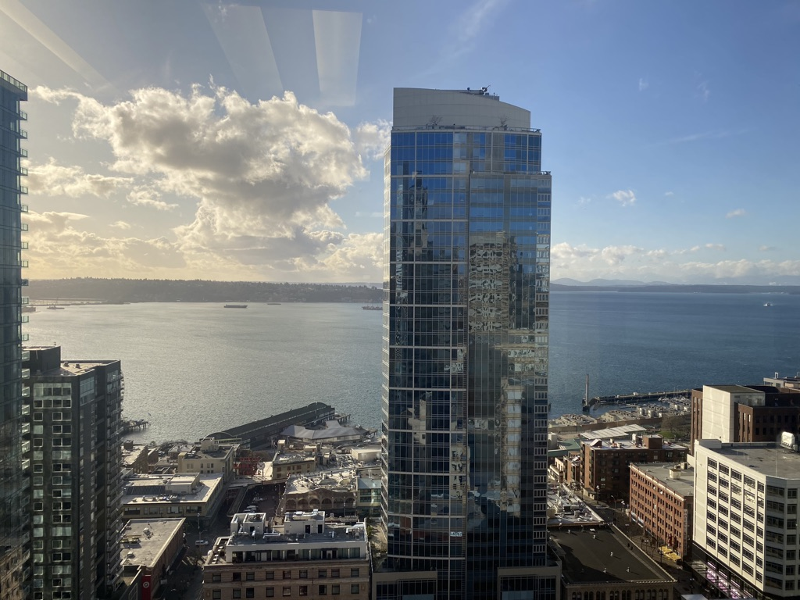
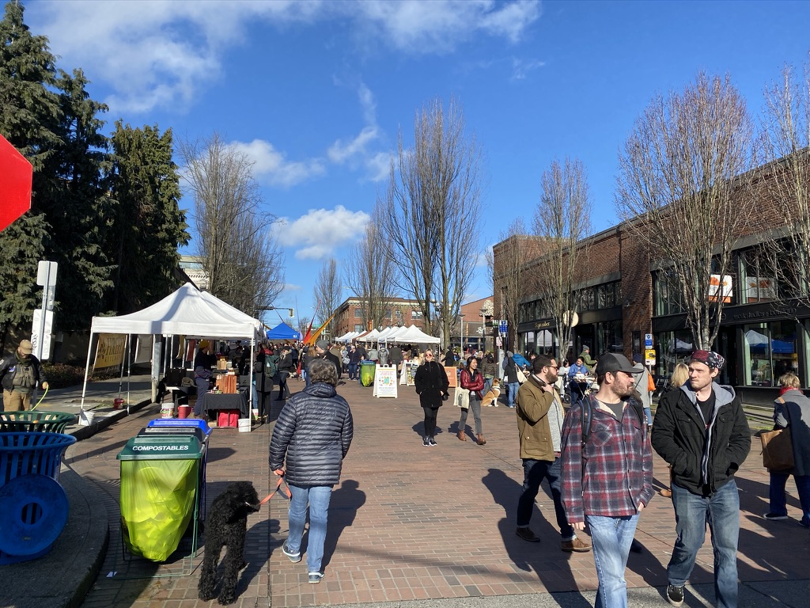
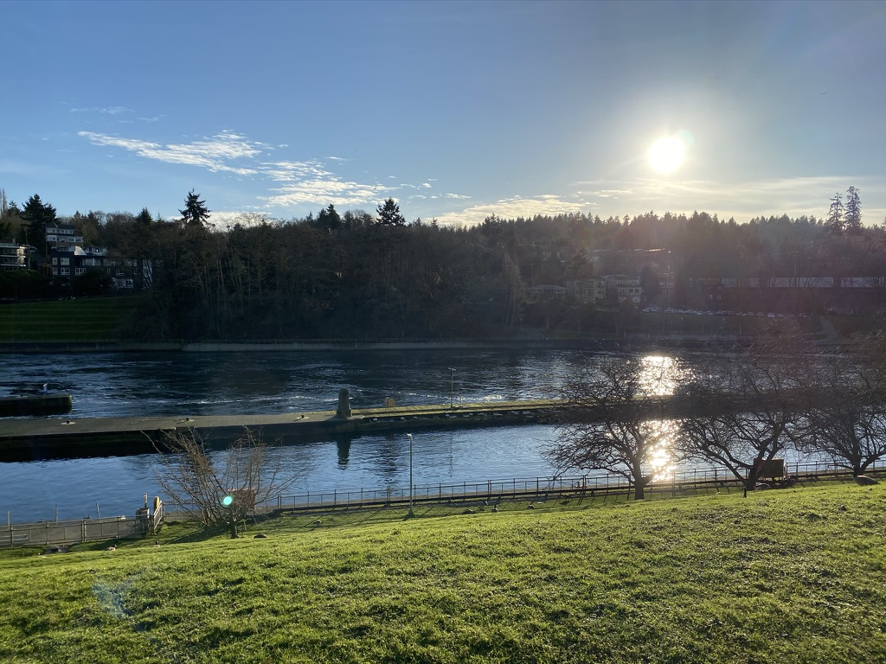
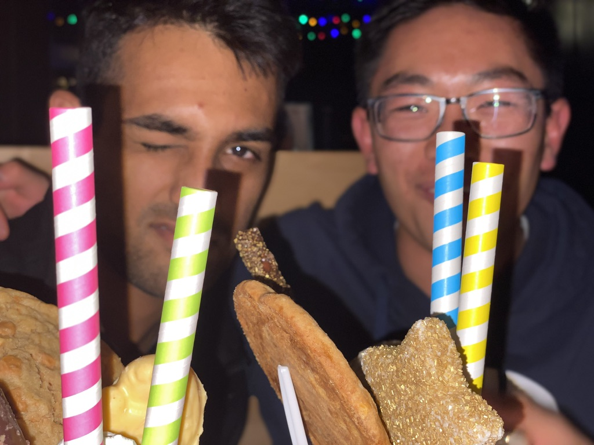

First semester of junior year was pretty tough. I was on the exec board for my business fraternity, I had a pretty demanding course schedule, I had just taken up a new job as an instructional aide, and I was one of the few people in my house of 7 who cleaned. And on top of it all, I was desperately searching for a summer internship. All of this was coming off the tail end of a relaxing summer away in the DC metro area, where I learned how bliss life can be with distinct boundaries between work and life. I read (and enjoyed!) books for the first time in years, I cooked most of my meals, I explored the city, and I meditated. But suddenly, I was thrown back into a world where the lines were blurred and I was the busiest I had ever been.

Not to say I didn’t have fun, though. I naturally got to spend a lot of time with others, as one does in college, and had my fair share of unforgettable nights. But there was one thing missing: a sense of self. The vast amount of time I spent with others and work I did for others drove me far away from things I did for myself and my mental health. Put simply, I couldn’t find enjoyment in the hobbies and passions that I thought I had found over the summer. And so when Convoy told me I could do an internship during the winter—a break from the hustle and bustle of school—I took it.

I was in Seattle for 10 weeks, which was just about the right amount of time I needed. I rented a room in someone’s house through Airbnb — in hindsight, I should’ve gotten a one-bedroom apartment, living in someone else’s house for 10 weeks was slightly weird. Apart from that, I had a great time working at Convoy - but more on that in a future post.

_Water and buildings_

As soon as I got settled down in Seattle, I started on the search for hobbies and passions to fill my time. The highlights of Seattle were definitely the food, book stores, farmer’s markets, coffee shops, the slopes, and the people I met at work. Over the 10 weeks I was in the Emerald City, there’s a few important lessons I learned.

_Ballard Farmer’s Market_

## Being comfortable alone

I became more comfortable being alone, especially in public places. During the previous summer in DC, most of my adventures were with other interns. I didn’t know many people in Seattle, and I easily could’ve not done things like going to farmer’s markets or coffee shops because I didn’t have anyone to go with, but I forced myself to step outside of my comfort zone and just go—and it was wildly rewarding. Though a ton of people were with their friends/significant others at the places I went, I learned to ignore the fact that I was alone and rather learned to appreciate the environments more and found comfort in my thoughts.

_Taken near the Chittenden Locks in Ballard_

## Appreciating the little things

It can be hard to catch a break in college — how can you, when there’s virtually always something you could/should be doing? Our minds are constantly focused on the next thing to do, and we rarely find a minute to look around and be grateful. My headspace was significantly less jumbled in Seattle, and that freed me to become more aware of the world we’re so lucky to live in. Whether it was just taking a deep breath every now and then, skiing in the mountains and being grateful for nature, or overhearing a group of old friends reconnecting at a local coffee shop, I was reminded that beyond all of the stress and “the grind” we subject ourselves to at school, we’re all just humans. It can do wonders for us to remember that from time to time, and to not get caught up in the moment.

_MLK weekend in Chicago_

## Realizing how special our relationships are

One of the best ways to realize how important people are to you is to take 10 weeks away from them: believe me, it worked. Making friends in the real world is tough, and making good friends is even harder. I met a lot of great people at work and developed some close bonds there. But when the work day was over, many of them had families and significant others to get back to, which made it difficult to socialize with colleagues outside of work. College is probably the only time in our lives that we’re around our friends for an overwhelming majority of our time, and I realized how special that is when I took a break from it.

---

At the end of the day, I did get to reconnect with my hobbies and explored a lot on my own. But in full honesty, there’s a bit of me that feels that in response to feeling burned out, I swung a bit too far the other way. Maybe there exists a happy medium where I could’ve stayed at school and still recovered from the burnout, but there's no value in dwelling on the past. Ya live and ya learn.

Being all alone in a new city for 10 weeks brought about some things I went in hoping for, but a whole bunch of things I never expected.
